# LearnGen — Staged Tutorial Builder

A GitHub template that turns a tutorial idea into a complete, deployable learning site. You describe what you want to teach, LearnGen scaffolds the project and builds each stage with AI agents.

## The Pitch

```
Idea → Roadmap → Stages → Docs Site → Learners
```

You provide the tutorial concept. LearnGen handles the rest: structured roadmap, branch-per-stage code, 8-file documentation per stage, VitePress site with dark mode and mermaid diagrams, GitHub Pages deployment.

## How It Works

### 1. Clone the template

```bash
gh repo create my-go-tutorial --template vedanta/learngen --public --clone
cd my-go-tutorial
```

### 2. Initialize (interactive 5-round flow)

```
@tutorial-init "Build a URL shortener with Go and SQLite"
```

The agent asks questions in 5 rounds, offering best-guess defaults at each step:

| Round | What it asks | What it produces |
|-------|-------------|-----------------|
| 1. Big Picture | What are you building? Who's the learner? What stack? | Project metadata, stack detection |
| 2. End State | What does the finished app do? How many stages? | Scope and stage count |
| 3. Stage Breakdown | Proposes stages (one concept each, always a working app) | Stage list with titles, concepts, summaries |
| 4. Grouping | Proposes groups (Foundation, Core, Advanced, Polish) | Group names, icons, descriptions |
| 5. Confirm & Scaffold | Shows full plan, generates all project files | Everything needed to start building |

### 3. Build stages

```
@tutorial-turbo              # builds + deploys the next pending stage
@tutorial-turbo --status     # shows progress table
@tutorial-turbo --stage=5    # builds a specific stage
```

Each invocation:
1. Reads `ROADMAP.md` for what to build
2. Checks `.tutorial-state.json` for progress
3. Creates a feature branch from the previous stage
4. Implements code + 8 doc files
5. Self-reviews for correctness and beginner-friendliness
6. Deploys docs to the VitePress site
7. Updates progress state

### 4. Done

Site is live at `https://<user>.github.io/<repo>/`

---

## Workflow Diagram

```mermaid
flowchart TD
    Start["@tutorial-init 'idea'"]

    Start --> R1["Round 1: Big Picture\n(stack, audience, core question)"]
    R1 --> R2["Round 2: End State\n(finished app, stage count)"]
    R2 --> R3["Round 3: Stage Breakdown\n(one concept per stage)"]
    R3 --> R4["Round 4: Grouping\n(Foundation, Core, Polish...)"]
    R4 --> R5["Round 5: Confirm & Scaffold"]

    R5 --> Files["Generated Files:\nROADMAP.md, CLAUDE.md, README.md\nMakefile, VitePress site, config"]

    Files --> Turbo["@tutorial-turbo\nor @tutorial-turbo --auto"]

    Turbo --> ReadState["Read ROADMAP.md +\n.tutorial-state.json"]
    ReadState --> FindNext{"Find next\npending stage"}

    FindNext -->|"All deployed"| Done["All stages complete!"]
    FindNext -->|"Stage N"| Build

    subgraph Build ["Step 3: Build (feature branch)"]
        CreateBranch["Create branch from\nprevious stage"] --> ReadContext["Read TEACHING.md\nCLAUDE.md, STANDARD.md"]
        ReadContext --> Code["Implement code\n(one concept)"]
        Code --> Docs["Generate 8 doc files\n(stage.json, readme, changelog,\nsteps, walkthrough, architecture,\nexercises, troubleshooting)"]
        Docs --> Review["Self-review\n(correctness, simplicity,\nstage discipline)"]
        Review --> CommitBranch["Commit + push\nfeature branch"]
    end

    CommitBranch --> StateBuilt["State: built"]

    subgraph Deploy ["Step 4: Deploy (main branch)"]
        PullDocs["Pull docs via\npull-stage-docs.sh"] --> UpdateSidebar["Update sidebar\nin config.mjs"]
        UpdateSidebar --> UpdateLanding["Update landing page\n(card to clickable)"]
        UpdateLanding --> UpdateOverview["Update overview\n(add stage link)"]
        UpdateOverview --> UpdateBadge["Update README\nbadge count"]
        UpdateBadge --> SiteBuild["npm run docs:build"]
        SiteBuild --> CommitMain["Commit + push main"]
    end

    StateBuilt --> Deploy
    CommitMain --> StateDeployed["State: deployed"]

    StateDeployed --> GHA["GitHub Actions\nauto-deploys to Pages"]

    StateDeployed -->|"--auto"| FindNext
    StateDeployed -->|"default"| Report["Report:\nStage N deployed\nNext: Stage N+1"]
```



### Summary

1. **Init** (once) — 5 interactive rounds produce the scaffold and roadmap
2. **Turbo** (per stage) — build on feature branch, deploy on main, GitHub Actions publishes
3. **Loop** — `--auto` continues to the next stage automatically; default stops after one

---

## Architecture

### File Structure (after `tutorial-init`)

```
my-tutorial/
├── .claude/agents/                 — 7 AI agents
│   ├── tutorial-init.md            — roadmap builder (interactive + import)
│   ├── tutorial-turbo.md           — master pipeline (build + deploy)
│   ├── tutorial-coder.md           — implements stage code
│   ├── tutorial-reviewer.md        — reviews code + docs
│   ├── docs-turbo.md               — code + docs + review combo
│   ├── docs-deploy.md              — deploys docs to site
│   └── docs-stage-prep.md          — validates docs before deploy
├── CLAUDE.md                       — coding standards (stack-specific)
├── README.md                       — project README with badges
├── Makefile                        — dev commands (stack-specific)
├── docs/
│   ├── ROADMAP.md                  — structured roadmap (YAML frontmatter)
│   └── STANDARD.md                 — 8-file doc standard
├── docs-site/
│   ├── package.json                — VitePress + mermaid
│   ├── docs/.vitepress/
│   │   ├── config.mjs              — sidebar, nav, dark mode, mermaid
│   │   └── theme/custom.css        — accent colors
│   ├── docs/index.md               — landing page with stage cards
│   ├── docs/overview.md            — tutorial overview + stage table
│   └── scripts/pull-stage-docs.sh  — pulls docs from feature branches
├── .github/workflows/
│   └── deploy-docs.yml             — GitHub Pages auto-deploy
├── .tutorial-state.json            — pipeline progress (gitignored)
└── .gitignore
```

### What's in the template vs what `tutorial-init` generates

| In template (generic, ready to use) | Generated by `tutorial-init` (project-specific) |
|---|---|
| All 7 agent definitions | `CLAUDE.md` — coding standards for the chosen stack |
| `STANDARD.md` — 8-file doc structure | `ROADMAP.md` — YAML frontmatter + detailed stage descriptions |
| `pull-stage-docs.sh` | `README.md` — title, badges, quick start |
| `deploy-docs.yml` skeleton | `Makefile` — stack-specific dev commands |
| VitePress package.json + theme | `config.mjs` — sidebar, nav, base path from roadmap |
| `.gitignore` | `index.md` — landing page with pipeline visual + stage cards |
| `LEARNGEN.md` usage guide | `overview.md` — tutorial overview + stage table |
| | `.tutorial-state.json` — all stages set to pending |
| | `custom.css` — accent colors |

### The Agents

| Agent | Model | Role |
|-------|-------|------|
| `tutorial-init` | opus | Builds the roadmap interactively or from import |
| `tutorial-turbo` | opus | Master pipeline — builds + deploys one stage per run |
| `tutorial-coder` | opus | Implements code for a stage |
| `tutorial-reviewer` | sonnet | Reviews code + docs for correctness |
| `docs-turbo` | opus | Combines coder + reviewer + doc validation |
| `docs-deploy` | sonnet | Pulls docs to main, updates site, builds |
| `docs-stage-prep` | sonnet | Validates docs are ready for deployment |

Agents are **stack-agnostic**. They read coding rules from `CLAUDE.md` and stage requirements from `ROADMAP.md` — the same agents work for Go, Python, React, or any web stack.

---

## ROADMAP.md Format

The roadmap is the single source of truth. YAML frontmatter for machine-readable data, markdown body for detailed descriptions.

```yaml
---
title: "Learn Go by Building a URL Shortener"
repo: "username/go-url-shortener"
base: "/go-url-shortener/"
accent: "amber"
stack:
  backend:
    go: "1.22"
    stdlib: "net/http"
  database:
    sqlite: "3"
  tools:
    go_modules: true
groups:
  - name: "Foundation"
    icon: "🏗️"
    desc: "Get a working server that responds to requests."
    stages: [0, 1, 2]
  - name: "Data Layer"
    icon: "💾"
    desc: "Add persistent storage so URLs survive restarts."
    stages: [3, 4]
  - name: "Features"
    icon: "⚡"
    desc: "Track clicks, show stats, validate input."
    stages: [5, 6, 7]
  - name: "Polish"
    icon: "✨"
    desc: "Custom codes, error handling, deployment."
    stages: [8, 9]
stages:
  - number: 0
    title: "Hello Server"
    branch: "main"
    tag: "v0-hello-server"
    concept: "net/http basics"
    summary: "A server that responds hello"
  - number: 1
    title: "In-Memory Store"
    branch: "feature/01-memory-store"
    tag: "v1-memory-store"
    concept: "maps and URL redirection"
    summary: "Generate short codes, redirect to original URLs"
  # ... etc
---

# Detailed Stage Descriptions

## Stage 0 — Hello Server
...
```

### What reads from it

| Consumer | Fields used |
|---|---|
| `tutorial-turbo` | stages[N] → title, branch, concept, summary |
| `docs-deploy` | stages[N] → title, branch; groups → sidebar structure |
| `tutorial-init` | Writes the entire file |
| `config.mjs` generator | groups, stages → sidebar entries |
| Landing page generator | groups, stages → stage cards with grouping |
| `stage.json` per branch | Seeded from stages[N] + stack |

---

## Pipeline State: `.tutorial-state.json`

Tracks build progress locally (gitignored).

```json
{
  "roadmap": "docs/ROADMAP.md",
  "last_updated": "2026-03-19T10:30:00Z",
  "stages": {
    "0": { "status": "deployed", "branch": "main", "built_at": "...", "deployed_at": "..." },
    "1": { "status": "built", "branch": "feature/01-memory-store", "built_at": "..." },
    "2": { "status": "pending" }
  }
}
```

**Status flow:** `pending` → `building` → `built` → `deployed`

- `pending` — not started
- `building` — agent is working (crash recovery: resumes from here)
- `built` — code + docs committed on feature branch, awaiting deploy
- `deployed` — pulled to main, site updated, live

---

## 8-File Doc Standard Per Stage

Every stage branch has these files in `docs/`:

| File | Purpose |
|------|---------|
| `stage.json` | Machine-readable metadata (number, title, branch, concept, stack) |
| `readme.md` | What you'll learn, prerequisites, outcome |
| `changelog.md` | What changed from the previous stage |
| `steps.md` | Step-by-step recipe (commands + file edits) to build from scratch |
| `walkthrough.md` | Line-by-line code explanation with GitHub source links |
| `architecture.md` | Project structure + mermaid data flow diagrams |
| `exercises.md` | 3–5 hands-on experiments (reversible, under 5 min) |
| `troubleshooting.md` | Common errors + FAQ for this stage |

---

## Stage Ordering Principles

Used by `tutorial-init` when proposing stages:

1. **Scaffold first** — get a running app before adding features
2. **Read before write** — display data before creating/editing it
3. **One concept per stage** — never combine new patterns
4. **Build on the last stage** — each stage extends the previous
5. **Backend before frontend** — add the API endpoint before the UI that calls it
6. **Simple before complex** — basic state before context, inline styles before libraries
7. **CRUD order** — Read → Create → Update → Delete
8. **Every stage runs** — no half-built states, the app always works

---

## VitePress Site Features

- **Dark mode default** with user toggle
- **Mermaid diagrams** in architecture pages (via `vitepress-plugin-mermaid`)
- **Collapsible sidebar** — each stage is a group that expands to show its 7 pages
- **Landing page** — hero, feature cards, visual pipeline, grouped stage cards with progress
- **Available stages** are highlighted (amber) and clickable; upcoming stages are dimmed
- **GitHub Actions** auto-deploys on push to main

---

## Import Mode

```
@tutorial-init --import=path/to/outline.md
```

Reads an existing outline in any format:
- Markdown with headings or numbered lists
- JSON/YAML structured data
- Plain text bullet points
- Course syllabus or blog post series

The agent extracts topics and maps them to stages, applies the ordering principles, fills gaps, and enters the interactive flow at Round 3 (stage breakdown) with pre-filled stages for review.

---

## Supported Stacks (initial)

| Stack | Backend | Frontend | Example Tutorial |
|-------|---------|----------|-----------------|
| React + FastAPI | Python, FastAPI, Uvicorn | React, Vite | Fortune App |
| React + Express | Node.js, Express | React, Vite | Todo App |
| Go + stdlib | Go, net/http | HTML templates | URL Shortener |
| Python + Django | Python, Django | Django templates or React | Blog |
| Node + Hono | Node.js/Bun, Hono | HTMX or React | Chat App |

Each stack generates appropriate `CLAUDE.md` coding standards and `Makefile` dev commands.

---

## Reference Implementation

The [Fortune App](https://github.com/vedanta/fortune-app) is the first tutorial built with this pattern. It demonstrates:
- 15-stage React + FastAPI tutorial
- Full VitePress docs site at [vedanta.github.io/fortune-app](https://vedanta.github.io/fortune-app/)
- All agents and pipeline automation
- The roadmap-driven build process

LearnGen extracts the generic parts of this into a reusable template.
